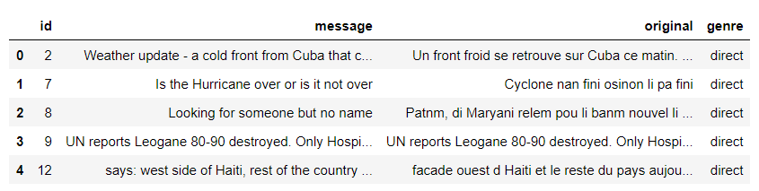
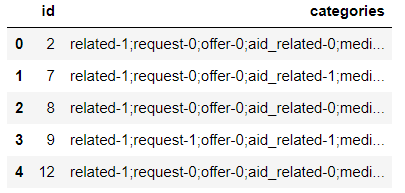

# DisasterRepsonseUdacity

## Github repository for the project "Disaster Response Pipeline" of the Udacity Data Scientist Nanodegree

### Business Understanding
The project analyzes messages that are sent by individuals who are affected by disasters. It uses machine learning techniques in order to categorize them into relevant categories. This categorisation can be used by Disaster relief organizations to efficiently respond to the needs of those affected by the disaster.

### Data Understanding
The raw data is contained in 2 .csv files. The messages.csv file contains the following columns:

- Id: A unique ID for each message
- message: an english translation of the message (if applicable)
- original: the original text of the message
- genre: the type of message, for example a direct message or a news article

The categories.csv file contains the following columns:
- Id: A unique ID for each messages 
- categories: a string that contains a pre existing classification of the message into on or more of the 36 categories
-   

### Data Preparation
The single string of the "categories" column is split up into 36 columns that either contain a "1" or "0" decoding whether or not the message belongs to that category. Then a single dataframe is created. Some data cleaning is necessary, in particular:

- The data set contains some duplicates. They have been removed.
- The category classification contains some "2" values, which are likely typos. They have been removed.
- The message column contains some messages that are not in english. The fasttext library is used to identify and remove those.

The cleaned dataframe is stored in a SQL table for later use.

### Modeling
The 

### Evaluation

### Deployment

#### File Descriptions

#### Packages and licenses

> Written with [StackEdit](https://stackedit.io/).